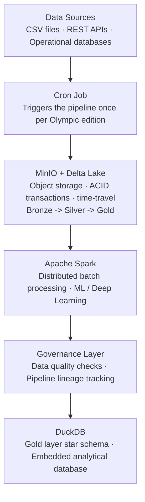
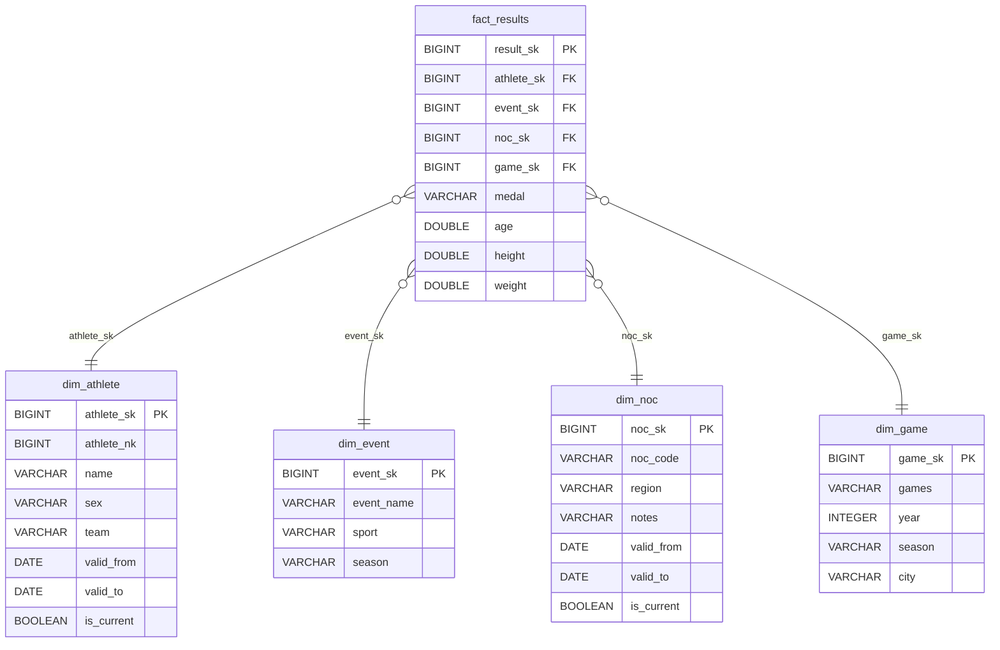

# IOC Olympic Analytics Platform

Data engineering pipeline for 120 years of Olympic history, built on a self-hosted open-source stack.

---

## Architecture

The platform follows a **Medallion architecture** (Bronze → Silver → Gold) across five layers.



| Component | Role | Why |
|-----------|------|-----|
| **Cron job** | Orchestration | The pipeline runs once per Olympic edition (every ~2 years); a cron job is sufficient to schedule and trigger it |
| **MinIO + Delta Lake** | Storage | S3-compatible object store (self-hosted); Delta Lake adds ACID transactions and time-travel on top of Parquet |
| **Apache Spark** | Processing | Handles any data volume; natively supports batch, ML, and deep learning workloads |
| **Governance layer** | Quality & Lineage | Data quality checks validate schema, nulls, and accepted values between layers; a lineage table in DuckDB records every pipeline step (source, target, row count, timestamp) |
| **DuckDB** | Analytics | Embedded analytical database; stores the gold layer star schema and supports interactive SQL queries without a server |

### Justification

Every component in this platform is open source and self hosted, ensuring the IOC retains full ownership of its data with no vendor lock in.

**MinIO** provides S3 compatible object storage that can be deployed on premises or in any cloud, paired with **Delta Lake** to guarantee ACID transactions and time travel over Parquet files. This combination gives us a reliable, versioned data lake without depending on proprietary cloud storage.

**Apache Spark** was chosen as the processing engine because it scales horizontally from a single machine to thousands of nodes, and natively supports batch workloads, machine learning (MLlib), and deep learning (integration with TensorFlow and PyTorch). A single engine covers analytics and ML requirements, reducing operational complexity.

Orchestration is handled by a **cron job**. The Olympic calendar produces new data once every two years at most, so a lightweight scheduler is more appropriate than a full workflow engine like Airflow.

The **governance layer** runs data quality checks between pipeline layers (schema validation, null checks, accepted values) and records full pipeline lineage in a dedicated table, tracking every step with its source, target, row count, and timestamp. This provides auditability and early detection of data issues before they reach the gold layer.

**DuckDB** serves as the gold layer analytical database. It stores the star schema in a single file, supports fast SQL queries without running a server, and includes a built in web UI for interactive exploration.

This architecture is modular. Each component can be replaced independently as requirements evolve, and the entire stack can run on commodity hardware without licensing costs.

---

## Star Schema



| Table | SCD | Reason |
|-------|-----|--------|
| `dim_game` | Type 0 | Olympic editions are immutable historical facts |
| `dim_event` | Type 1 | Sport classification corrections should overwrite history |
| `dim_athlete` | Type 2 | Athletes can change name or team — history must be preserved |
| `dim_noc` | Type 2 | Countries rename over time (e.g. USSR → Russia) |

---

## Pipeline

Simulates the architecture locally using **PySpark** (Bronze/Silver), **Parquet files** (MinIO), and **DuckDB** (Gold layer). A governance layer runs data quality checks between layers and records pipeline lineage in DuckDB. SCD logic runs in pandas — sequential by nature, not suitable for distributed execution.

```
data/raw/          CSV files (Kaggle dataset)
data/bronze/       Raw Parquet — no transformations
data/silver/       Cleaned Parquet — types corrected, duplicates removed
data/gold/         DuckDB star schema — SCD applied per Olympic edition
```

### Prerequisites

- **Python 3.11 or 3.12** (3.13+ is not yet supported by PySpark)
- **Java 17** (required by PySpark)
- **DuckDB CLI** (optional, for exploring the gold layer interactively)

#### macOS (Homebrew)

```bash
brew install python@3.12 openjdk@17 duckdb
```

Set `JAVA_HOME` before running the pipeline or tests (add to your shell profile to persist):

```bash
export JAVA_HOME=$(brew --prefix openjdk@17)
```

### Setup

```bash
python3.12 -m venv venv
source venv/bin/activate
pip install -r requirements.txt
```

Place the Kaggle CSV files in `data/raw/`:
- `athlete_events.csv`
- `noc_regions.csv`

### Run

```bash
source venv/bin/activate
python main.py
```

Each Olympic edition is processed as an independent batch, in chronological order, so SCD history builds correctly.

### Type check

```bash
python -m mypy src/ main.py
```

### Tests

```bash
python -m pytest tests/ -v
```

> **Note:** PySpark tests require `JAVA_HOME` to be set. On Windows, a working Hadoop `winutils.exe` is also needed.
> CI runs on Ubuntu (see `.github/workflows/ci.yml`).

---

## Explore the results

```bash
# Linux/macOS
duckdb -ui data/gold/olympics.duckdb

# Windows
./duckdb.exe -ui data/gold/olympics.duckdb
```

Or query directly in Python:

```python
import duckdb
conn = duckdb.connect("data/gold/olympics.duckdb")

conn.execute("""
    SELECT a.name, a.team, COUNT(*) AS medals
    FROM fact_results f
    JOIN dim_athlete a ON a.athlete_sk = f.athlete_sk
    WHERE f.medal IS NOT NULL AND a.is_current
    GROUP BY a.name, a.team
    ORDER BY medals DESC
    LIMIT 10
""").df()
```

---

## Dataset

[120 years of Olympic history — Kaggle](https://www.kaggle.com/datasets/heesoo37/120-years-of-olympic-history-athletes-and-results)
